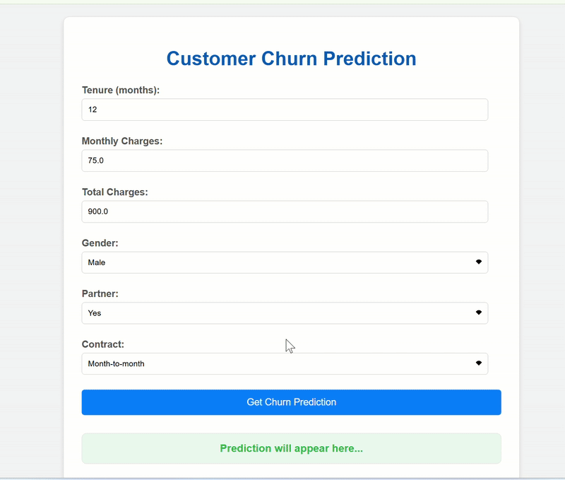

# Customer Churn Prediction: An End-to-End Machine Learning Application

This project presents a comprehensive machine learning solution for predicting customer churn in a telecommunications context. It encompasses data processing, model development, API creation, and containerized deployment, showcasing an end-to-end MLOps workflow.

## Demo

Experience the live application:



*(Ensure this GIF is uploaded to your GitHub repository in a suitable location, and update the path above if needed.)*

## Project Components

This project is structured around key components of an ML application lifecycle:

* **Data Processing:** Handling raw data, cleaning, and engineering relevant features.
* **Machine Learning Modeling:** Training and evaluating classification models for churn prediction.
* **RESTful API:** A Flask-based backend service to expose the trained model for predictions.
* **Web User Interface (UI):** A simple HTML/JavaScript frontend for interactive predictions.
* **Containerization (Docker):** Packaging the entire application into a portable and consistent unit.

## Methodology

### Data Source

The project utilizes the [IBM Telco Customer Churn dataset](https://www.kaggle.com/datasets/blastchar/telco-customer-churn) from Kaggle, a widely recognized dataset for churn analysis.

### Data Preprocessing & Exploratory Data Analysis (EDA)

* **`TotalCharges` Handling:** The `TotalCharges` column, initially containing empty strings, was converted to a numeric type (`float`). Missing values (resulting from empty strings) were imputed using `tenure * MonthlyCharges`, providing a more accurate estimate, with `0` for new customers.
* **Feature Engineering:** A new feature, `Charge_per_Tenure` (`TotalCharges / Tenure`), was created. This feature represents the customer's average monthly spending over their tenure and offers distinct predictive insight compared to `MonthlyCharges`.
* **Key Data Insights:**
    * **Monthly Charges:** Customers with **higher `MonthlyCharges` demonstrated a greater propensity to churn**, while non-churning customers were concentrated at lower charges.
    * **Class Imbalance:** The `Churn` target variable exhibits a **significant class imbalance**, with a majority of non-churning customers. This observation guided the choice of evaluation metrics.

### Model Training & Evaluation

A machine learning pipeline was constructed using `scikit-learn`'s `ColumnTransformer` for robust preprocessing (imputation, scaling for numerical features; one-hot encoding for categorical features), followed by model training and hyperparameter tuning using `RandomizedSearchCV`.

Given the class imbalance, **ROC AUC** was selected as the primary scoring metric for model evaluation, providing a more reliable measure of classifier performance than accuracy.

**Models Evaluated:**

* Logistic Regression
* Random Forest Classifier
* XGBoost Classifier (Gradient Boosting)

**Key Results (Cross-Validation & Test Set ROC AUC):**

| Model | Cross-Validation ROC AUC | Test Set ROC AUC |
| :------------------------- | :----------------------- | :--------------- |
| Logistic Regression | 0.8454 | 0.8444 |
| Random Forest Classifier | 0.8422 | 0.8267 |
| **XGBoost Classifier** | **0.8509** | **0.8439** |

**Observations:**

* The **XGBoost Classifier** demonstrated the strongest performance based on ROC AUC, indicating its superior ability to distinguish between churners and non-churners.
* The impact of class imbalance was evident in classifier reports, highlighting the necessity of advanced evaluation metrics beyond simple accuracy.

## Deployment

The final trained XGBoost model is deployed as a web service.

* **Flask API:** The `app.py` serves as a RESTful API, loading the trained model and accepting customer feature data via POST requests to return churn predictions.
* **Web UI:** The `index.html` provides a simple user interface for interacting with the prediction API directly from a web browser.
* **Docker Containerization:** The entire application stack is containerized using Docker, ensuring portability, reproducibility, and ease of deployment across different environments.

## How to Run This Project Locally

To set up and run this project on your machine:

1.  **Clone the Repository:**
    ```bash
    git clone [https://github.com/Sandro-Chopikashvili/Customer-Churn-Prediction-Deployment.git](https://github.com/Sandro-Chopikashvili/Customer-Churn-Prediction-Deployment.git)
    cd Customer-Churn-Prediction-Deployment
    ```
2.  **Set Up Python Virtual Environment:**
    ```bash
    python -m venv venv
    .\venv\Scripts\activate   # On Windows
    # source venv/bin/activate # On macOS/Linux
    ```
3.  **Install Dependencies:**
    ```bash
    pip install -r requirements.txt
    ```
4.  **Download Data:**
    * Obtain the `WA_Fn-UseC_-Telco-Customer-Churn.csv` file from [Kaggle](https://www.kaggle.com/datasets/blastchar/telco-customer-churn).
    * Place this file into the `data/` directory within your project.
5.  **Train & Save Model (via Jupyter Notebook):**
    * Start Jupyter Lab: `jupyter lab`
    * Open `notebooks/01-EDA-and-Preprocessing.ipynb` and execute all cells. This notebook performs data cleaning, feature engineering, model training/evaluation, and crucially, saves the `best_xgb_churn_model_pipeline.joblib` file into the `models/` directory.
6.  **Build Docker Image:**
    * Ensure Docker Desktop is running.
    * In your project's root directory (where `Dockerfile` is located), execute:
        ```bash
        docker build -t churn-prediction-app .
        ```
7.  **Run Docker Container:**
    * Once the image build completes, launch your application in a Docker container:
        ```bash
        docker run -p 5000:5000 churn-prediction-app
        ```
    * Leave this terminal window running.
8.  **Access the Web App:**
    * Open your web browser and navigate to `http://127.0.0.1:5000/`.
    * Fill out the form and get your churn predictions!

## Future Enhancements

Potential areas for further development and improvement include:

* **Advanced Feature Engineering:** Exploring more complex data interactions, time-series analysis (if historical data becomes available), or integrating external data sources.
* **Model Interpretability:** Implementing SHAP or LIME to explain individual model predictions for business insights.
* **Deployment Automation:** Setting up CI/CD pipelines for automated testing and deployment.
* **Production-Ready Deployment:** Transitioning from Flask's development server to a production-grade WSGI server (like Gunicorn) and deploying to cloud platforms (e.g., AWS, GCP, Azure).
* **Real-time Monitoring:** Implementing dashboards and alerts for continuous model performance monitoring.

## Author

[Sandro-Chopikashvili - GitHub Profile](https://github.com/Sandro-Chopikashvili)